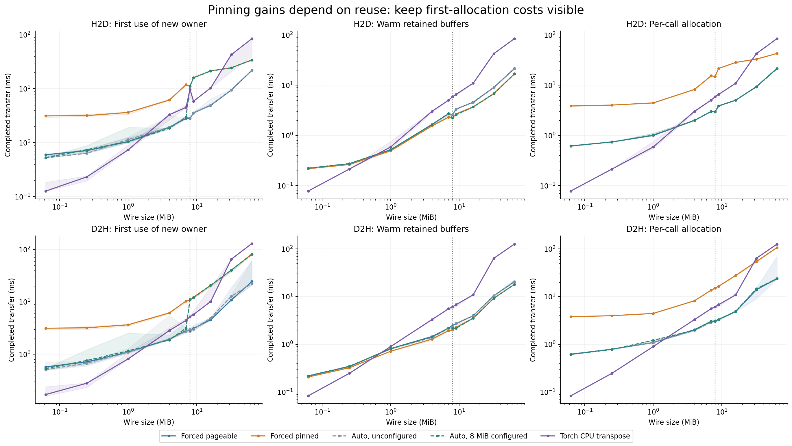
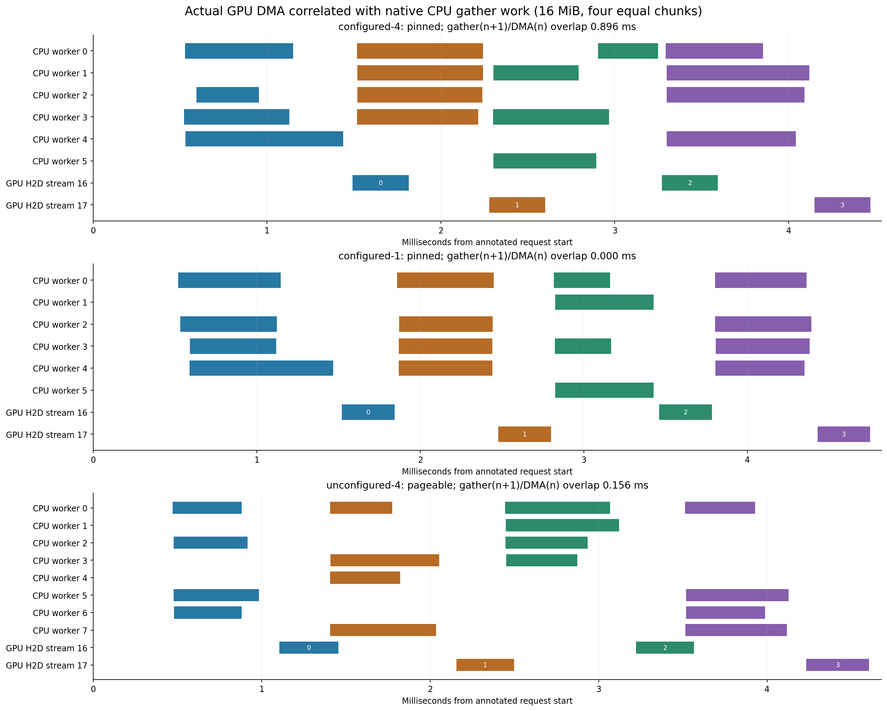
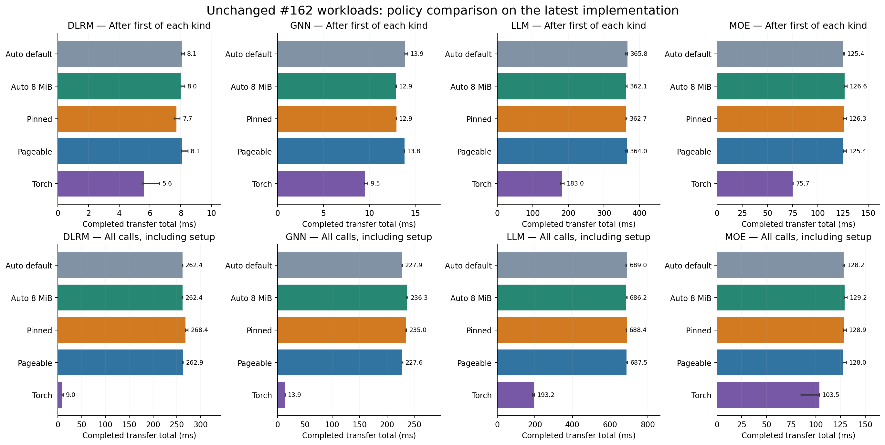

# #189 pinning qualification evidence

[Standalone report](report.html) · [PDF figures](figures.pdf) · [Numerical summary](summary.json) · [Source/binary provenance](provenance.json)







Runtime behavior is #206, now merged as `b6298bcf11ff4e78cb4a93186deec143f3123dc4`.
Qualification tests are #207, rebased to `44566d50e6ec163039986768a89585f29dc47de1`.
Benchmark scripts/docs are `f81399dacce33afdbb2e8fdda202a1d20285d3ea` and also
archived under `inputs/`. No GPU kernels changed in this qualification.
`provenance.json` proves byte-identical source trees through the intervening
rebases/squash merges. Sweeps ran with uncommitted benchmark scripts/docs; the
recorded script hashes match the archived files. Runtime code was committed.

The PR #162 workload files are byte-identical to commit
`cdc44e278eac08d51abc6e1fd13123a5a46a26b8`, verified file by file and archived here.
PR #162 was neither merged nor changed. The wrapper passes an explicit owner to
direct typed calls and selects the pinning policy; bodies and GPU compute remain
unchanged. This measures completed transfer latency, not whole-model throughput.

## Findings and limits

- Default auto has no threshold and uses pageable staging. Explicit auto at
  8 MiB has a warm profitable region on this EPYC 7351 / RTX 2080 Ti setup.
  At 16 MiB, forced warm H2D is 3.700 ms pinned vs 4.596 ms pageable; D2H is
  3.533 vs 3.986 ms. All three round medians and every call are retained.
- First retained pinned calls still lose: 16 MiB H2D is 21.449 vs 4.904 ms;
  D2H is 20.675 vs 4.555 ms. First means a new owner, with CUDA/compiler already
  initialized. Final owner close and result destruction are outside the timer.
  Warm gains require enough reuse to repay allocation. The runtime has no reuse
  predictor; outside a qualified profile, leave the threshold unset.
- The pinned four-buffer trace has 0.893/0.896/0.906 ms of actual DMA overlapping
  CPU work on the next chunk. Its single-buffer control has zero in all three
  requests. Pageable has 0.151/0.156/0.174 ms on this driver. All cases use the
  same 16 MiB payload and four 4 MiB chunks. CPU ranges are wall intervals and
  may include preemption. Native submission/API ranges are used for correlation,
  not as substitutes for GPU DMA activity.
- The size-sweep Torch baseline uses a CPU transpose, not a GPU transpose or
  Inductor. Some large transpose cases favor Sym; this does not imply Sym beats
  every Torch implementation. Torch remains faster in all four complete #162
  workload bodies. All-call workload figures preserve compilation/setup costs.
- Three rounds with unlocked clocks qualify this machine/configuration, not a
  universal threshold or a statistical guarantee. Some small policy differences
  in the full workloads are within run variation. No adaptive cost model is
  implemented; its design is tracked separately in #208.

## Data and validation

`sweep-h2d.json` and `sweep-d2h.json` contain 270 rows each: 10 sizes × 9 variants
(4 Sym policies × 2 ownership modes, plus Torch) × 3 shuffled rounds. Each row
preserves 1 first call, 2 warmups and 10 repeated samples: **7,020 completed
transfers**, each checked against Torch outside the timer. Each record includes
actual staging choices and resource counters. Shaded ranges span the three
round medians; they are not confidence intervals.

`matrix/` contains **48 passing fresh-process runs**, three per policy/workload,
with both paired Torch and Sym raw samples. Each original workload runs Torch
before Sym; process ordering is shuffled. Model compute and correctness checks
are outside the timer. `summary.json` includes first, after-first and all-call
values for every pair. Plotted Torch bars use the paired auto-default runs.

`traces/` contains raw Nsight reports, SQLite exports, exact commands, allocation
reports, independently correlated intervals and portable Chrome/Perfetto traces.
The middle of three requests is plotted consistently; it is not selected by
speed or overlap. NVTX is enabled only for these captures, not latency timings.

`validation/` records 901 Python tests passed (4 skipped), 318 native tests passed
(2 skipped), and all 12 CTest checks passed. CI also passed build, tests,
clang-format, clang-tidy, CPU Torch inventory and CPU wheels on #206; #207's
CPU-wheel job passed before its content-preserving rebase. The initial broad
all-target build hit an unrelated R-track `double atomicAdd` compilation error
with global default `sm_52`; required targets were subsequently built and all
CTest checks passed. The runtime explicitly builds `sm_75;sm_89`. This is not a
claim that every unrelated CUDA benchmark target built.

## Exact measurement configuration

EPYC 7351, RTX 2080 Ti GPU 0 UUID
`GPU-3d1f8d63-b97b-4647-b4bb-0e543b4019cf`, NVIDIA driver 595.71.05,
CUDA toolkit 12.6.3, Torch 2.14.0+cu126, Python 3.14.7. Eight Torch/gather threads,
one interop thread; CPU affinity `4-7,20-23`. GPU clocks are not locked; the CPU
governor was not changed. No performance jobs ran concurrently with another
performance job or GPU test suite. CMake Release flags and build choices are in
`build-config/`; binary, compiler, CPU and device details are in each sweep's
`metadata` and each profile's `run.json`.

From the qualification source checkout, with the local tool paths used here:

```sh
export PYTHONPATH=/tmp/sym-pinning-build/python:/tmp/sym-pinning-qualification/libreloc/python
export SYM_RELOC_EXPORT=/tmp/sym-pinning-build/sym/tools/sym-reloc-export
export SYM_OPT=/tmp/sym-pinning-build/sym/tools/sym-opt
export OMP_NUM_THREADS=8 MKL_NUM_THREADS=8

taskset -c 4-7,20-23 /tmp/sym-torch-cuda/bin/python bench/issue189/pinning_sweep.py \
  --direction h2d --output /tmp/sym-pinning-results/sweep-h2d.json
taskset -c 4-7,20-23 /tmp/sym-torch-cuda/bin/python bench/issue189/pinning_sweep.py \
  --direction d2h --output /tmp/sym-pinning-results/sweep-d2h.json
taskset -c 4-7,20-23 /tmp/sym-torch-cuda/bin/python bench/issue189/run_matrix.py \
  --repo /tmp/sym-pr162-pageable --output /tmp/sym-pinning-results/matrix \
  --rounds 3 --variants auto_default,auto_configured,pinned,pageable
```

Profile the separate NVTX build with the archived
`inputs/run_profiles.executed.py` (adjust local paths), or follow the commands in
`docs/pinning-qualification.md`. Captures use Nsight Systems 2024.5.1.113 with
CUDA/NVTX tracing, CUDA-profiler API capture ranges, no instruction sampling and
no context-switch tracing. Every profile and analyzer command is in its log.

```sh
/tmp/sym-pr162-plot/bin/python bench/issue189/qualification_report.py \
  --results /tmp/sym-pinning-results
sha256sum -c SHA256SUMS
```

The HTML embeds all PNG images, so the downloaded file is self-contained. PNG,
SVG and PDF files are also provided for sharing. The implementation PR links
this evidence branch instead of adding measurement artifacts to main.
