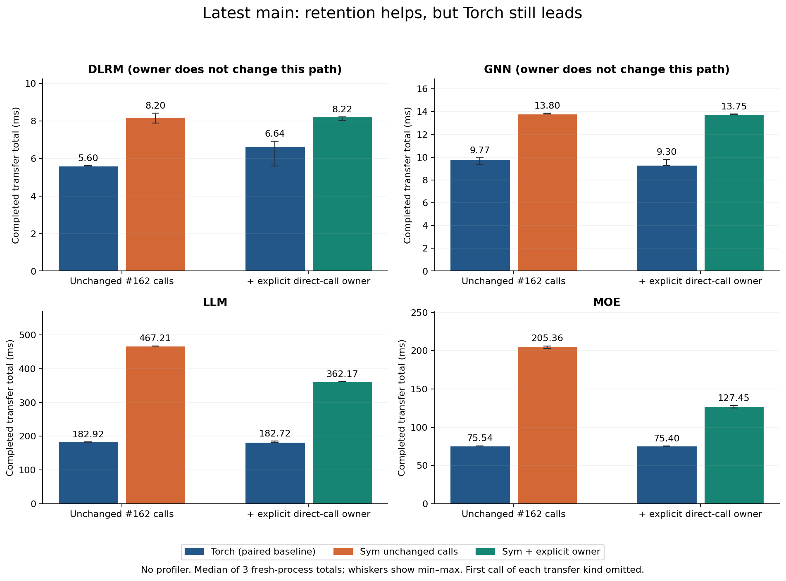
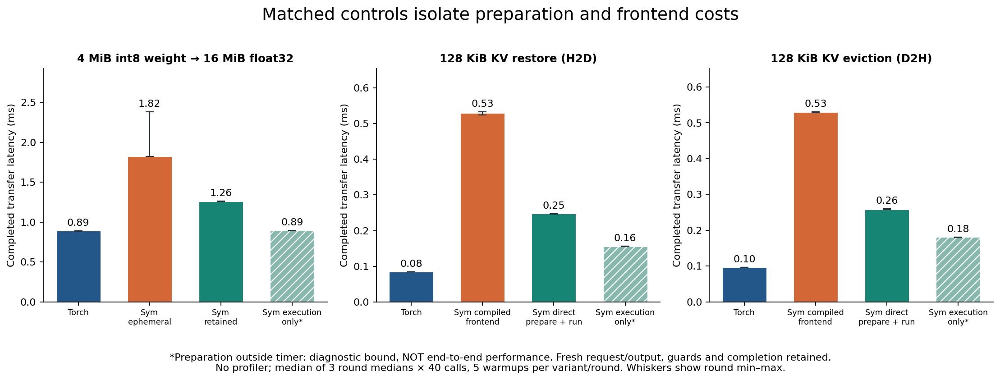
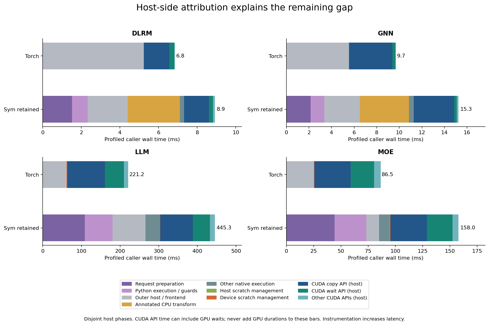
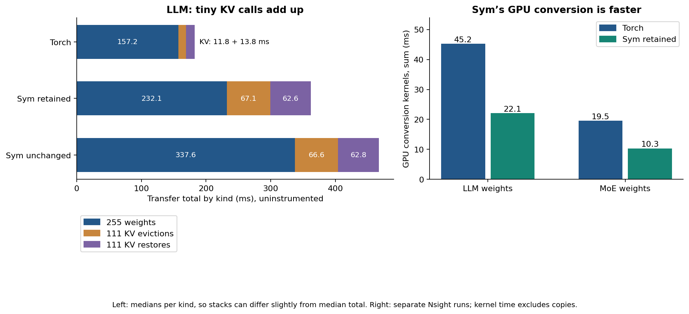
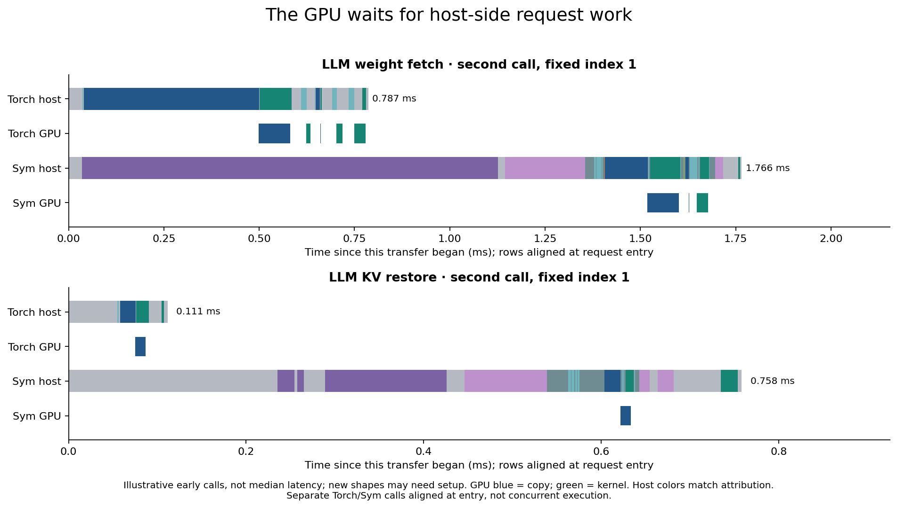

# Torch vs Sym on latest main — 2026-10-02

Open [report.html](report.html) locally for the full report with embedded images.
The figures also render directly on GitHub:

Runtime: main `519f6a1c3699d10a3b59f352f89f55cf733f3113`, after #200, #206,
#207 and #209. Workload bodies: unmodified PR #162 head
`cdc44e278eac08d51abc6e1fd13123a5a46a26b8`. That PR remains open and unmerged.
Only benchmark/report scripts and diagnostic NVTX annotations were added for
this investigation; production runtime behavior was not changed.

The following are uninstrumented completed-transfer totals in milliseconds:
the median of three fresh-process rounds, omitting the first call of each kind.
They include request work, output allocation, conversion and device completion.
They exclude model computation and oracle checks, so they are not whole-model
throughput measurements. All-call totals are available in the report.

| Workload | Torch, original-call pair | Sym, original calls | Torch, owner-control pair | Sym, explicit direct owner |
|---|---:|---:|---:|---:|
| DLRM | 5.602 | 8.203 | 6.637 | 8.221 |
| GNN | 9.770 | 13.799 | 9.297 | 13.747 |
| LLM | 182.915 | 467.210 | 182.724 | 362.174 |
| MoE | 75.537 | 205.363 | 75.399 | 127.452 |

DLRM/GNN already use frontend-managed retention; the direct-owner flag does not
change their path. Their differences are ordinary run variation, not reuse
benefits. Original #162 weight fetches do not pass an owner. Adding one reduces
Sym LLM transfer time by 22.5% and MoE by 37.9%, but both remain slower than
their paired Torch baselines.

The six Nsight captures have identical ordered model kernel names and grid/block
dimensions within the annotated model regions. Transfer kernels differ: Sym's
fused GPU weight conversion is faster (LLM 22.10 vs 45.22 ms), while host-side
preparation and execution overhead outweigh that saving. A matched 4 MiB weight
control takes 0.889 ms with Torch and 1.260 ms with retained Sym. Executing a
fresh prepared request with preparation outside the timer takes 0.895 ms. That
last row is a diagnostic bound, not an end-to-end improvement.

For a 128 KiB KV restore, Torch takes 0.084 ms, Sym's compiled frontend 0.529 ms,
and direct Sym preparation plus execution 0.247 ms. The frontend and per-call
request layers are therefore the next targets supported by this evidence.
Correctness checks, mutation guards, fresh outputs and caller-stream ordering
must be retained in any optimization. Detailed qualifications are in the report.

All 24 final workload runs and six captures passed their workload checks with
zero fallbacks. All timed control outputs passed bitwise comparisons. Two
earlier batches affected by unrelated CPU jobs are preserved under `contended/`
and excluded from headline results. The final two-second monitor samples saw
none of those compiler/simulator jobs. This is not a guarantee of exclusive
machine access; clocks were unlocked and the original Torch-first order remains.

## Evidence and reproduction

- [Profiling tools and commands](../../workload_profile/README.md)
- [Summary data](summary.json), including per-round ranges and cold totals
- [Provenance](provenance.json): runtime/workload hashes, binaries, hardware,
  compiler reuse verification and script hashes
- `measurements/matrix/`: 24 JSON reports with raw per-call timings and logs
- `profiles/`: six `.nsys-rep` files, exported SQLite databases, correlated
  `.analysis.json` files, original reports and capture/export command logs
- `controls/`: raw samples, CPU call attribution, `.pstats` and readable profiles
- `build/`: CMake caches, configure/build logs and the exact native NVTX patch
- `contended/`: excluded timing reports and available monitors; duplicate large
  traces remain at `/tmp/sym-main-profile-results/contended` on the experiment host
- `figures/`: PNG, SVG and PDF exports
- [SHA256SUMS](SHA256SUMS): run `sha256sum -c SHA256SUMS` from this directory

The normal Release/CUDA runtime and extension were rebuilt from main with NVTX
off. A separate Release/CUDA build adds only diagnostic NVTX ranges. The
existing compiler binaries were reused after checking that their compiler
sources match main. Compiler recipe preparation outside the transfer function
is outside the timer. The report does not quantify asynchronous application
throughput or CPU/PCI overlap.
