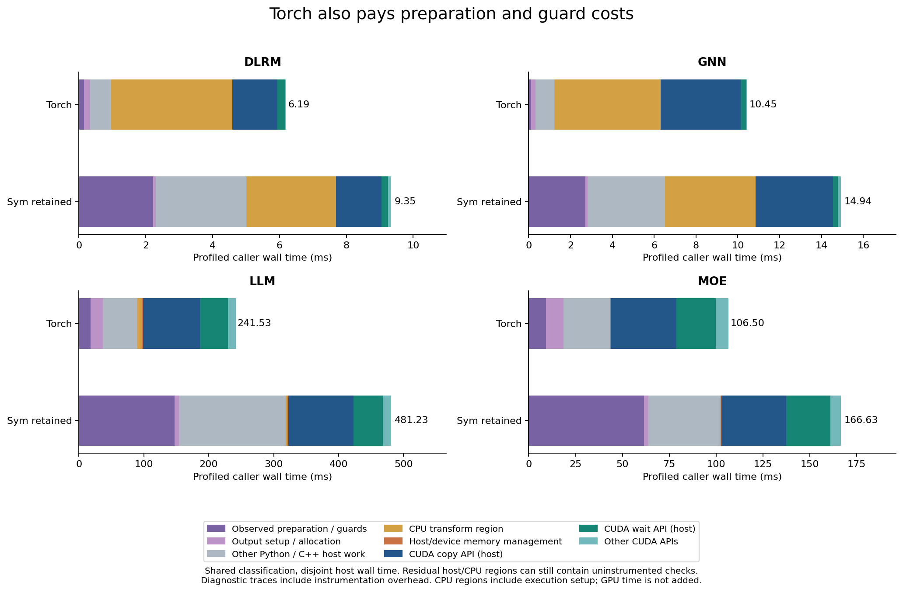
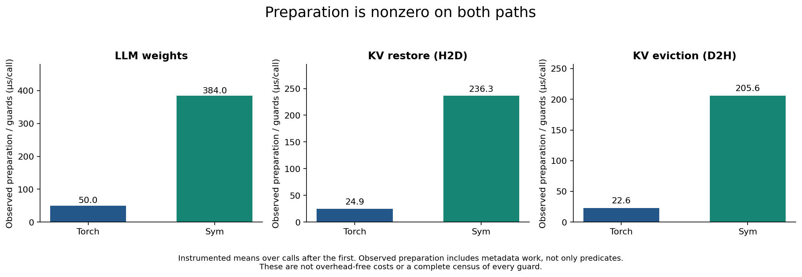
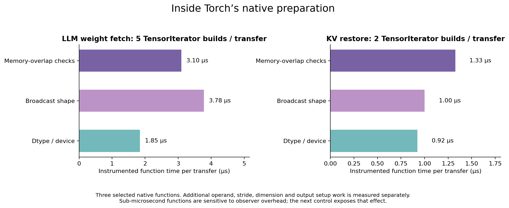
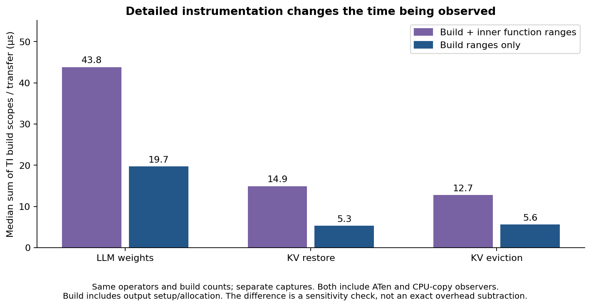
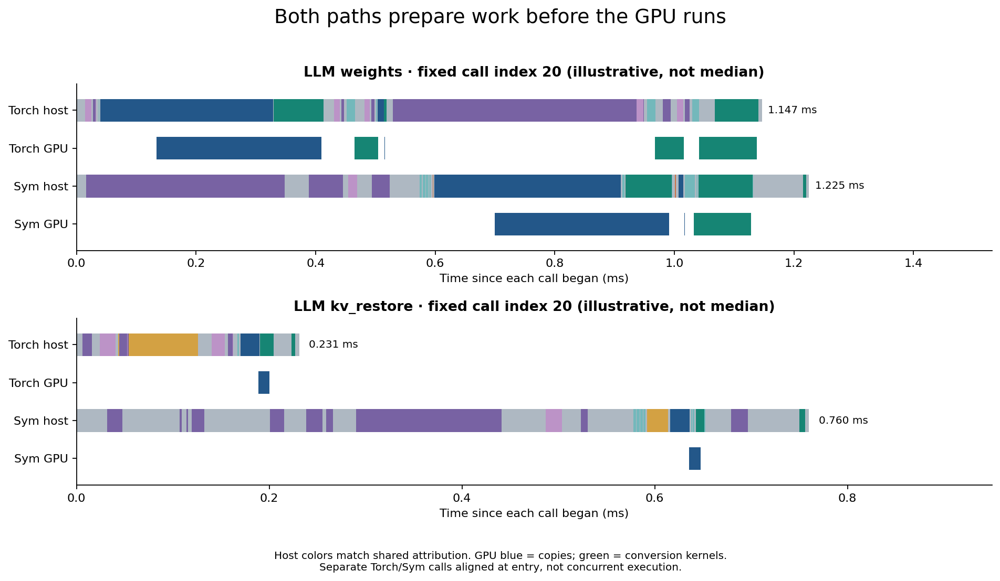

# Torch preparation and guards — symmetric profiling experiment

Open [report.html](report.html) locally for the standalone report. Its images
are embedded; PNG/SVG/PDF exports are also in `figures/`.

Torch's preparation/guard cost is nonzero. The previous graph only annotated
Sym preparation; Torch's corresponding work was mostly hidden in its host
residual. This experiment adds ATen ranges on both paths, native TensorIterator
function hooks, and a native observer identifying CPU-to-CPU copies from their
actual tensor devices.

The new graph applies shared disjoint categories to both paths. Residual
Python/C++ host work can still contain uninstrumented guards. CPU regions can
contain residual kernel setup/checks; these are caller-wall durations, not
pure kernel busy times.

| LLM transfer kind | Torch observed prep/guards, µs/call | Sym observed prep/guards, µs/call |
|---|---:|---:|
| Weight fetch | 50.00 | 384.03 |
| KV restore (H2D) | 24.86 | 236.35 |
| KV eviction (D2H) | 22.56 | 205.65 |

These are instrumented means, excluding the first call of each kind, and
include metadata work beyond predicates. They are not overhead-free costs or
guaranteed savings from a proposed optimization. The Torch weight path builds
five TensorIterators per transfer; each KV direction builds two.

Instrumentation has a substantial effect on small functions: the median sum of
Torch weight-fetch TensorIterator build ranges is 43.8 µs with inner ranges,
versus 19.7 µs when only build-level native preparation ranges remain. Both modes
retain ATen/CPU-copy observers, the same original operations and build counts.
Build includes output setup/allocation. This is a sensitivity control, not an
exact overhead subtraction or a pure guard-time estimate.

Fresh profiler-free paired measurements still favor Torch. Completed-transfer
totals with retained Sym are 362.493 vs 183.609 ms for LLM and 128.103 vs
75.516 ms for MoE. Full workload tables, min–max ranges, raw samples and the
matched controls are in the report. Model compute/oracle checks are outside the
transfer timer; first calls are omitted from headline totals, and preserved in
raw JSON. This is not whole-model throughput.

Runtime is main `519f6a1c3699d10a3b59f352f89f55cf733f3113`. The six workload
Python files match open PR #162 head `cdc44e278eac08d51abc6e1fd13123a5a46a26b8`.
Torch is 2.14.0+cu126 at `08187d9e0fba026dc8217405802ab5381dc88d90`.
No production runtime changes or PR merge were performed.

## Validation and evidence

- All 24 normal workload runs and five final captures pass workload checks;
  every timed matched-control output passes bitwise comparison.
- Native probe smoke tests preserve values and invalid-shape/overlap errors.
  The final captures have no callback exceptions, and checked callback counts
  match the expected preparation and CPU-copy operations.
- Model GPU kernel sequences/launch dimensions match within the captured model
  regions. GPU activity correlation, completion boundaries and exact host-time
  partitions pass the analyzer assertions.
- The final monitors sampled zero of the earlier background compiler/simulator
  jobs. This is not an exclusive-machine guarantee; clocks are unlocked, and the
  original examples retain Torch-first order and untimed oracle calls.
- Exploratory v1 and aborted prototype captures remain local at
  `/tmp/sym-torch-side-results`; published captures use the final v2 probe.

Artifacts:

- [Reproduction tools and commands](../../torch_profile/README.md)
- [Numerical summary](summary.json) and [provenance](provenance.json)
- `measurements/`: profiler-free results and all per-call samples
- `controls/`: fresh timing controls and paired Python call profiles
- `profiles/`: final four captures with full native preparation ranges
- `coarse/`: LLM control with build-level preparation ranges
- Each capture includes `.nsys-rep`, `.sqlite.gz`, `.analysis.json.gz`, original
  workload JSON, logs, command lists and host monitor samples.
- `build/`: final native probe build metadata, smoke result and Sym's unchanged
  native annotation patch
- [SHA256SUMS](SHA256SUMS): run `sha256sum -c SHA256SUMS` in this directory

The native probe is diagnostic and ABI-specific. The compiler sources and
runtime binaries are the same as the previous main profiling experiment;
provenance verifies their hashes. Only the trace process loads the Torch probe.
