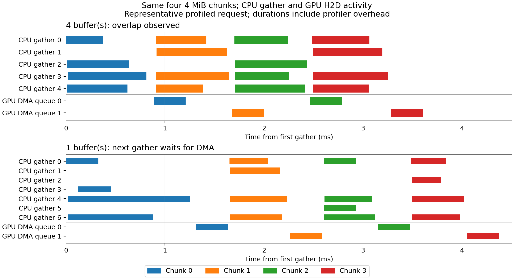

# Completed frontend resource reuse: EPYC 7351 / RTX 2080 Ti

Resource retention reduces repeated frontend transfer time while preserving CPU–PCIe overlap on this machine. It does not make Sym universally faster than Torch. Every measured transfer uses a fresh output, current-input binding/validation, and completion inside the timer.

This is evidence for #171 under parent #165. The benchmark runs the merged #184 frontend through `torch.compile` / `RelocBackend`; it is not the earlier native prototype that reused output storage. `None` reconstructs staging, streams and gather workers for each call. A retained owner keeps compatible native contexts between calls; tensor contents and outputs remain request-specific.

## Protocol and provenance

- Measurement source: `57002270b683b3684c50ccb14ca2a2a4dd4717c1`, with a clean worktree for both thread budgets. The later portable-timeline change in `14a8289` does not alter the benchmark or runtime. Traces use clean source `14a82897baf55308c4421c42be6f64c69fa3830c`. These source changes reached main in #185 (`23401a28de813eb99c53df426cc3eb9d9aafe001`); its tree matches the traced revision. Full source/binary hashes are in each JSON.
- AMD EPYC 7351; GPU 0, RTX 2080 Ti, PCIe Gen3 x16 under load; driver 595.71.05. CPython 3.14.7, Torch 2.14.0+cu126, CUDA 12.6. Release runtime, NVTX disabled for latency runs.
- CPU affinity: CPU 4 for one participant; CPUs 4–7 and 20–23 for eight participants (four physical cores with SMT), local to GPU 0. Torch CPU and Sym receive the same participant budget. Native gather may use fewer participants on small chunks.
- FP32 transpose, pageable contiguous CPU input for H2D, dense CUDA input for D2H. CPU Inductor + H2D and H2D + GPU transpose allocate their intermediates/outputs normally. No output-buffer reuse.
- Five warmups; three deterministically shuffled method rounds; 30 warmed samples per round. Inputs alternate two exact integer payloads per shape. Compilation, input creation, correctness checks and cache inspection are outside timing. Each sample includes caller-stream completion.
- Competing methods' caches are cleared between blocks. The first measured call after compilation and cache clearing is separate from warmed samples; process/CUDA initialization and compiler startup are excluded. Clocks are unlocked, and correctness checks touch CPU data between samples; no cache flushing.
- Tables use the median of the three round p50s (and median of round p95s where shown). p95 is nearest rank within each 30-sample round. All raw samples, round order, initial-call values and before/after counters are retained in [one-thread JSON](latency-t1.json) and [eight-thread JSON](latency-t8.json).

Reproduce with [the committed harness and protocol](../../transfer_resource_reuse.md). The final results include all planned cases; there are no skipped measurement or overlap rows.

## Completed H2D latency

Milliseconds. Speedup compares the same Sym frontend and settings with per-call versus retained resources.

| Threads | Source shape | Sym None p50 / p95 | Sym retained p50 / p95 | Reuse speedup | CPU Inductor + H2D p50 | H2D + GPU transpose p50 |
| --- | --- | ---: | ---: | ---: | ---: | ---: |
| 1 | 4096 × 1024 | 29.948 / 31.118 | 6.789 / 7.220 | 4.41× | 12.289 | 1.926 |
| 1 | 1024 × 4096 | 29.083 / 29.715 | 5.938 / 6.138 | 4.90× | 10.105 | 1.923 |
| 1 | 256 × 1024 | 4.492 / 4.979 | 1.206 / 1.646 | 3.72× | 0.615 | 0.223 |
| 1 | 1009 × 4093 | 29.833 / 30.339 | 6.478 / 6.953 | 4.61× | 6.028 | 1.878 |
| 8 | 4096 × 1024 | 28.624 / 29.005 | 4.507 / 4.953 | 6.35× | 5.503 | 2.073 |
| 8 | 1024 × 4096 | 28.933 / 29.681 | 4.487 / 4.953 | 6.45× | 5.163 | 2.058 |
| 8 | 256 × 1024 | 5.311 / 5.810 | 1.229 / 1.698 | 4.32× | 0.404 | 0.211 |
| 8 | 1009 × 4093 | 29.358 / 29.904 | 4.632 / 5.147 | 6.34× | 3.996 | 2.016 |

CPU Inductor wins over retained Sym on the small and odd-sized cases; Sym wins over that CPU baseline on the two rectangular reference cases. The GPU-transpose path remains faster on every listed H2D row. Binding/validation and fresh-output overhead remain part of the Sym frontend, so retention alone does not remove the small-transfer disadvantage.

## First transfer after compilation and emptying the cache

Milliseconds, median of three first-transfer observations. These are resource-startup measurements, not cold-process or compilation measurements. None includes resource destruction before return; retained resources remain live after return.

| Threads | Source shape | Sym None first | Sym retained first | Sym retained warmed p50 |
| --- | --- | ---: | ---: | ---: |
| 1 | 4096 × 1024 | 29.856 | 23.305 | 6.789 |
| 1 | 1024 × 4096 | 29.196 | 22.632 | 5.938 |
| 1 | 256 × 1024 | 4.507 | 3.514 | 1.206 |
| 1 | 1009 × 4093 | 29.856 | 22.962 | 6.478 |
| 8 | 4096 × 1024 | 28.573 | 21.751 | 4.507 |
| 8 | 1024 × 4096 | 28.809 | 21.585 | 4.487 |
| 8 | 256 × 1024 | 5.362 | 3.830 | 1.229 |
| 8 | 1009 × 4093 | 28.882 | 22.405 | 4.632 |

## Forward D2H and changing shapes

The D2H path downloads the source and then gathers on the CPU; this work does not introduce a new D2H overlap schedule. Values are completed-call p50 in milliseconds.

| Threads | Source shape / workload | Direction | Sym None | Sym retained | Torch comparison |
| --- | --- | --- | ---: | ---: | ---: |
| 1 | alternating all four shapes | h2d | 29.302 | 5.899 | 1.921 |
| 1 | alternating all four shapes | d2h | 28.771 | 6.761 | 1.859 |
| 1 | 4096 × 1024 | d2h | 29.810 | 7.546 | 1.895 |
| 1 | 1024 × 4096 | d2h | 28.741 | 6.395 | 1.882 |
| 1 | 256 × 1024 | d2h | 4.513 | 1.180 | 0.215 |
| 1 | 1009 × 4093 | d2h | 29.161 | 7.160 | 1.836 |
| 8 | alternating all four shapes | h2d | 29.097 | 4.468 | 2.028 |
| 8 | alternating all four shapes | d2h | 27.003 | 4.319 | 1.923 |
| 8 | 4096 × 1024 | d2h | 27.650 | 4.376 | 1.962 |
| 8 | 1024 × 4096 | d2h | 27.733 | 4.392 | 1.946 |
| 8 | 256 × 1024 | d2h | 5.265 | 1.288 | 0.225 |
| 8 | 1009 × 4093 | d2h | 27.303 | 4.288 | 1.914 |

The changing-shape sequence visits two payloads for each listed shape before cycling. Cache counters remain stable after warming all compatible capacities. The last column uses GPU transpose on the source GPU for D2H, and after H2D for the H2D row.

## Concurrent completed throughput

Two callers each complete 30 transfers of 4096×1024, on separate caller streams, over three rounds. Values are median aggregate calls/s. Both callers share the stated affinity; each receives the full gather budget. The measured window includes barrier release and worker completion, but excludes compilation/warmup and validation of retained first/last outputs.

| Threads per caller | Sym None calls/s | Sym retained calls/s | Speedup |
| --- | ---: | ---: | ---: |
| 1 | 33.1 | 145.2 | 4.39× |
| 8 | 37.3 | 322.5 | 8.64× |

The one-CPU configuration is a contention measurement, not a scaling claim. Eight participants per caller can oversubscribe four physical cores with SMT. Raw per-caller latencies and completed payload GiB/s are in the JSON.

## Resource and memory checks

Every warmed retained block, including changing shapes and concurrency, adds **zero staging allocations, stream creations and worker creations**. Recorded event counts return to zero after completion. Across this matrix, each shared owner peaks at 32 MiB of staging, two contexts, four streams, and (for the eight-participant setting) 14 background gather workers. Limits were 256 MiB retained staging, 512 MiB live staging, four contexts total/two per device, 64 background workers and a 30-second admission timeout.

Fresh output allocation is still included. JSON distinguishes native staging/retained capacity from CUDA tensor allocator peaks. Process peak RSS includes Torch/compiler state and is a cumulative high-water mark. None/Torch do not expose native cache counters; null is not a measured zero. The observed footprint supports these workloads only; broader long-run and failure bounds remain #172.

## CPU–PCIe overlap and the serialized control

| Threads | Four buffers p50 (ms) | One buffer p50 (ms) | One / four ratio |
| --- | ---: | ---: | ---: |
| 1 | 6.762 | 6.975 | 1.031× |
| 8 | 4.554 | 4.956 | 1.088× |

Both controls use two streams, the same gather budget, and the same four 4 MiB chunks. One buffer gates the next gather on the prior DMA completing. Its retained staging is 4 MiB versus 16 MiB with four buffers, so memory footprint and producer cadence also differ; the latency gap alone is not an isolated measurement of overlap.

The separate Nsight Systems 2024.5.1 captures use the NVTX-enabled Release build, eight participants and five warmed requests. The analyzer correlates each native submission to CUDA API and GPU activity records, then intersects DMA(n) with the union of worker gather(n+1) intervals. It uses actual GPU DMA timestamps; the CPU intervals cover the gather call rather than the driver barrier. Intervals include scheduler/profiler effects and are not CPU utilization measurements.



Both captures pass all five completed requests. Actual GPU copy sizes are four times 4,194,304 bytes per request in both configurations.

| Buffers | Requests with overlap | Adjacent chunk transitions with overlap | Overlap per transition (µs) |
| --- | ---: | ---: | ---: |
| 4 | 5 / 5 | 15 / 15 | 277.370–305.391 |
| 1 | 0 / 5 | 0 / 15 | 0 |

The one-buffer result passes the serialization control. The figure selects request 1 (the second request) from each capture and gives them the same time scale. CPU rows identify the threads that participated in that request, rather than fixed worker slots across captures; the native 1 MiB minimum per participant gives four active gather participants per 4 MiB chunk, and background thread selection can vary between chunks. GPU rows are stream IDs, not separate copy engines. [Four-buffer analysis](trace-buffers4-overlap.json) and [one-buffer analysis](trace-buffers1-overlap.json) contain every request and interval.

Raw [four-buffer capture](trace-buffers4.nsys-rep) and [one-buffer capture](trace-buffers1.nsys-rep) are included with compressed SQLite exports, metadata, numerical overlap records and portable Chrome timelines. Profiling durations are excluded from the latency tables. Missing annotations/GPU activities would fail qualification; no such capability gap occurred here.

## Measurement limits and enablement

An initial protocol left competing methods' caches alive between blocks. On 1 MiB H2D, per-call allocation p50 changed from 4.476 to 1.260/1.256 ms once the other owner retained staging. A controlled rerun that clears every competing owner restored 4.528/4.468/4.478 ms versus retained 1.202/1.189/1.193 ms. The final matrix uses that isolation rule throughout; the driver-level mechanism behind this allocation-state effect was not identified. [Diagnostic samples](allocation-state-diagnostic.json) preserve the observation. This is why the report specifies live resource ownership and retains round-level raw samples.

All final steady-state Sym retention comparisons improve on their matched None policy; no unexplained retention regression remains in this matrix. Cold resource creation still costs time, and the evidence does not promise a universal advantage over CPU Inductor or GPU transpose. There is no second-machine result, locked-clock experiment, or general workload placement policy here.

#171 supplies the performance and overlap gate. #172 still must complete broader lifecycle/failure/stream/device/sanitizer qualification. These measurements do not enable AUTO by default; #173 remains blocked until both gates are reviewed.


## Artifact verification and validation

The latency files preserve 7,380 timed calls across both budgets. Every latency sample completes before return; concurrency validation retains and checks the first/last outputs per caller, as described in the protocol. All 78 warmed retained blocks report zero new staging allocations, stream creations or worker creations. Their completed snapshots have zero outstanding events. The native counter peaks support the resource bounds stated above.

The seven focused benchmark tests passed after the allocation-isolation fix, including the real CUDA subprocess that covers every scenario. The six CPU tests were rerun after the numeric Chrome process-ID change and passed. Native runtime and both dependency guards passed in normal and NVTX-enabled Release builds (three CTest checks each). All seven GitHub checks passed for #185 before merge. These are the R6 checks; they do not substitute for R7 qualification.

Verify artifact integrity from this directory:

```sh
sha256sum -c SHA256SUMS
```

Reproduce the numerical analysis from the committed SQLite exports, from the repository root:

```sh
artifact=bench/results/transfer-resource-reuse-171
for buffers in 4 1; do
  gzip -dc "$artifact/trace-buffers$buffers.sqlite.gz" > "/tmp/reuse-$buffers.sqlite"
  python bench/analyze_resource_overlap.py "/tmp/reuse-$buffers.sqlite" \
    --output "/tmp/reuse-$buffers-overlap.json" --chrome "/tmp/reuse-$buffers-timeline.json"
  diff "$artifact/trace-buffers$buffers-overlap.json" "/tmp/reuse-$buffers-overlap.json"
  diff "$artifact/trace-buffers$buffers-timeline.json" "/tmp/reuse-$buffers-timeline.json"
done
```

The SQLite SHA-256 is also recorded in each overlap JSON. The native `.nsys-rep` captures can be opened with Nsight Systems; the portable `*-timeline.json` files can be opened in Perfetto. For fresh measurements, use the protocol linked above and record the new source and configuration metadata rather than comparing enqueue-only timings.

The plot requires Matplotlib (3.10.9 was used), only in the reporting environment:

```sh
python bench/plot_resource_overlap.py \
  "$artifact/trace-buffers4-overlap.json" "$artifact/trace-buffers1-overlap.json" \
  --output /tmp/resource-overlap.png
```
