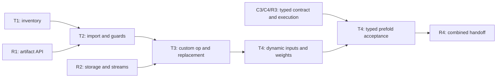

# Torch finalization subissue plans

Date: 2026-09-09. T1 inventory implementation and observed qualification are
documented in [Torch support](../torch-support.md). Child issues
[#134](https://github.com/JueonPark/sym/issues/134) (T1),
[#135](https://github.com/JueonPark/sym/issues/135) (T2),
[#136](https://github.com/JueonPark/sym/issues/136) (T3), and
[#137](https://github.com/JueonPark/sym/issues/137) (T4) are open.
T2 and its R1 compiler-artifact prerequisite are implemented. T3's custom op,
graph replacement, eager routing, cache and fallback are implemented, and R2's
`reloc_torch.transport` adapter now executes real blocking H2D and forward D2H
transfers behind them; the T3 CUDA acceptance suite passes on real hardware
(see [Torch support](../torch-support.md)). T4's dynamic-reuse evidence,
prepared inference weights, examples and [installation guide](../torch-integration.md)
are implemented; its quantized-prefold acceptance waits for C3/C4/R3 under
[#131](https://github.com/JueonPark/sym/issues/131).

These plans expand section 1 of [the project finalization plan](../project-finalization-plan.md).
T1–T4 are work identifiers corresponding to those child issues. Each linked document
contains the proposed issue title, scope, file map, implementation tasks, and
acceptance evidence. Keep these plans together as project documentation.

| Child / proposed issue title | Plan | Depends on | Completion evidence |
| --- | --- | --- | --- |
| [Finalize][Torch][T1] Inventory transfers and define eligibility | [T1](t1-transfer-inventory.md) | None | Versioned eager/FX inventory, reason-coded eligibility matrix, CPU tests and CUDA observations |
| [Finalize][Torch][T2] Import FX relocation recipes with symbolic guards | [T2](t2-fx-import-and-guards.md) | T1 contracts; R1 artifact acceptance (implemented) | Implemented: verified static/symbolic plans, strict portable artifacts, exact compiler/runtime reference comparisons, compiler-bail and guard tests |
| [Finalize][Torch][T3] Replace eligible transfers with a guarded custom op | [T3](t3-custom-op-and-replacement.md) | T1/T2 and R1/R2 | Real H2D/D2H, fake metadata and opcheck, graph/eager fallback, stream and lifetime tests |
| [Finalize][Torch][T4] Validate dynamic reuse and manage weight lifecycle | [T4](t4-dynamic-inputs-and-weights.md) | T3; C3/C4/R3 for typed prefolding | Rebinding counters, fresh weight results after updates, lifecycle tests, runnable examples and installation guide |

## Scope and starting evidence

The source audit used commit `9c8b49ab8219eedb8aaec966cc942c5fc10fc41d`.
The earlier local audit used Python `3.10.12` and PyTorch `2.5.1+cu121`;
those versions are historical observations, **not the integration target**.
The existing `build/sym` has `RELOC_ENABLE_CUDA=OFF` and a Python 3.10
extension. T1 must create fresh environments and rebuild the extension for
the selected baseline below. T1 now qualifies observation on fresh CPU/cu126 builds; see the support evidence.

## Selected version baseline

Use **CPython 3.14.7 with the standard GIL build and PyTorch 2.14.0** for
T1–T4. The decision is current as of 2026-09-09 and applies to Linux x86_64
CPU/CUDA validation. These exact versions are the initial qualification
target; package availability does not itself certify the integration.

| Component | Selection | Reason and validation obligation |
| --- | --- | --- |
| Python | CPython `3.14.7`, regular `cp314` ABI | Current stable Python maintenance release; provides a longer maintenance runway for a new frontend. Python 3.15 is still a prerelease. Free-threaded `cp314t`, subinterpreters and experimental interpreter modes need separate lifecycle/locking tests and are outside this baseline. |
| PyTorch | `2.14.0`, CPU and `cu126` wheels | Current stable release with Python 3.14 support and the backend, dispatch and custom-op APIs this integration uses. Run the complete T1 inventory and T2/T3 conformance on this release. |
| CUDA | PyTorch `2.14.0+cu126`; CUDA toolkit `12.6.3` for libreloc | Choose the explicitly published CUDA 12.6 wheel instead of the default CUDA 13.0 distribution. Preserve libreloc's existing `75;89` targets and validate on the Turing/Ada machines; this task does not require new CUDA 13 features. |
| Python bridge | `pybind11==3.0.4` | pybind11 3 supports Python 3.14; rebuild `_pyreloc` with matching interpreter/headers and modern FindPython discovery. Keep pyreloc and the C++ runtime torch-free. |
| Test dependencies | `pytest>=9,<10`, `numpy>=2.3.3,<3` | Use Python-3.14-capable releases; record exact resolved versions in qualification results. NumPy 2.3.3 explicitly supports Python 3.14. |
| Compiler/runtime | Existing LLVM/MLIR `21.1.8` pin and current runtime language settings | PyTorch's own C++20 build requirement does not require a libtorch-free runtime to adopt Torch headers or change its C++ standard. |

Python 3.14.7 was released on August 5, 2026; PyTorch 2.14 was released on
September 2, 2026. The official compatibility matrix includes Python 3.14
and CUDA 12.6. Published CPU and cu126 indexes both contain regular
`cp314-cp314-manylinux_2_28_x86_64` wheels for Torch 2.14.0. Sources:
[Python release](https://www.python.org/downloads/release/python-3147/),
[Python release status](https://www.python.org/downloads/),
[PyTorch release](https://pytorch.org/blog/pytorch-2-14-release-blog/),
[compatibility matrix](https://github.com/pytorch/pytorch/blob/main/RELEASE.md),
[CPU wheels](https://download.pytorch.org/whl/cpu/torch/),
[CUDA 12.6 wheels](https://download.pytorch.org/whl/cu126/torch/).
Dependency support is documented in the
[pybind11 changelog](https://pybind11.readthedocs.io/en/stable/changelog.html),
[NumPy 2.3.3 release notes](https://numpy.org/doc/stable/release/2.3.3-notes.html),
and [pytest compatibility policy](https://docs.pytest.org/en/stable/backwards-compatibility.html).

Qualify this one combination first; do not add a broad version matrix to M1.
Subsequent Python 3.14 or PyTorch 2.14 patch upgrades update the explicit
allowlist/pins and rerun the affected inventory, custom-op, binding and CUDA
tests. Other Python/PyTorch minor versions and wheel variants remain
unqualified until that evidence exists. This does not reduce the independent
standalone runtime's existing support surface.

## Repository boundaries

| Existing surface | Consequence for this work |
| --- | --- |
| `libreloc/python/pyreloc/__init__.py` exposes load/bind/relocate/h2d/d2h | Add a sibling optional `reloc_torch` package; ordinary `pyreloc` imports must remain torch-free. |
| `libreloc/python/pyreloc/torch_interop.py::as_ptr` accepts contiguous tensors | Do not generalize tensor storage binding by passing `data_ptr()` and `numel()` for arbitrary views. R2's `pyreloc.BufferView` describes the whole allocation plus the logical view instead. |
| `sym/dialect/reloc/Transforms/PlanBuilder.h` seeds dense row-major input with zero offset | First imported recipes require a contiguous, zero-offset root; views inside a captured recipe are distinct from a strided external input. |
| `RelocFold.cpp` marks complete failed chains `reloc.fallback` | A successful compiler process is insufficient: export must report whether the whole requested chain folded. |
| `libreloc/test/corpus/generate_corpus.py` extracts test-pass diagnostics | This is test infrastructure; T2 consumes R1's supported exporter instead of shipping that extraction in the frontend. |
| `BoundPlan.extents` is coalesced iteration space | Preserve logical output shape/strides separately; do not reconstruct a Torch tensor's rank from bound iteration axes. |
| `PyReloc.cpp::d2hCuda` calls inverse scatter | R2 provides forward D2H through `pyreloc.make_transfer(..., "d2h")` (staging copy plus forward host gather); `pyreloc.d2h` remains the inverse-scatter API. |
| `Prefold.h::OutputSpec` has only `S8GatherQuant` and `S8QuantPack`; Python exposes neither | Plain f32 weight relocation cannot call this prefolder. T4 uses normal layout preparation first and wraps existing quantized prefolding only after typed capability validation. |

## Shared constraints

The following requirements apply to every task in all four plans:

- "Preserve the CPU relocation plus pipelined transfer implementation and the existing compiler/runtime separation."
- "Any automatic placement must choose among implementations of the same requested computation; it must not silently introduce a cast or quantization to improve transfer time."
- "Unsupported cases execute through the original PyTorch path with a recorded reason."
- "Gradient-requiring execution falls back until autograd is explicitly supported."
- "A speedup or a conference-paper contribution is not an acceptance condition."
- CPython `3.14.7` (GIL enabled), PyTorch `2.14.0`, CPU/cu126, and the dependency
  pins in [the selected baseline](#selected-version-baseline) govern all tasks.
- Initial scope is opt-in inference/weight loading, dense CPU/CUDA tensors,
  unchanged dtype, rank at least one, nonempty storage, zero-offset contiguous
  recipe roots, and fresh contiguous zero-offset outputs. Tensor subclasses,
  sparse/quantized tensor storage, overlapping views, arbitrary strided roots,
  training, distributed execution, autocast-sensitive conversion, and other
  devices fall back with distinct reasons. Supported ranks/dtypes are the
  intersection of compiler, binder, and execution capabilities, not a guessed limit.
- Start with blocking transfers. A request with `non_blocking=True` follows
  PyTorch until R2 proves completion, stream ordering, and allocator lifetime.
- `copy_` and any other mutation remain on PyTorch in the first release.
  View-only operations remain views. A cross-device identity plan still copies.
- Float32, float16, and int8 **layout-only** recipes are the initial dtype
  candidates, drawn from the existing corpus. Each direction needs execution
  evidence before its eligibility entry becomes enabled.
- No compiler/runtime wire changes belong to T1–T3. Typed importer enablement
  is jointly owned with C4 after C1–C3/R3; no guessed typed schema.

## Interfaces and ownership

T1–T4 names below are implemented interfaces (T4's typed prefold
integration is gated on C3/C4/R3). The T3 / R2 bridge rows are implemented on the T3 side
(`reloc_torch.runtime.TransportAdapter` delegates to R2's
`prepare_transfer`/`execute_transfer` and reports their absence as
`runtime_unavailable`). `pyreloc.load_plan`, `pyreloc.bind`, and the execution functions are
existing runtime interfaces. Keep compiler
artifacts independent of Python object identities and process-local caches.

| Owner | Interface | Required contract |
| --- | --- | --- |
| T1 | `compat.check_version() -> None` | Check the qualified CPython 3.14.7 GIL build and PyTorch 2.14.0 CPU/cu126 combination at explicit activation; report interpreter, Torch and wheel mismatches separately. Importing core pyreloc is unaffected. |
| T1 | `observe_transfers() -> TransferObserver` | Scoped, observational dispatch mode; `.records` contains immutable metadata records; `.phase(name)` supplies input/output/weight-loading labels. |
| T1 | `eligibility.classify(record: TransferRecord) -> Eligibility` | Pure classification: transfer/layout/cast/mutation category, candidate boolean, stable reason. Candidate is not proof of runtime capability. |
| T1 | `graph_inventory(gm: torch.fx.GraphModule) -> tuple[GraphRecord, ...]` | Describe raw FX call_function/call_method targets, tensor metadata and producer/user links without executing the graph. |
| T2 | `normalize_graph(gm, example_inputs) -> torch.fx.GraphModule` | Version-pinned translation of inventoried targets to the allowed ATen forms; preserve original graph and effects. Never replay real transfers to normalize. |
| T2 | `import_graph(gm, example_inputs) -> ImportReport` | Return immutable candidates and reason-coded exclusions, without modifying `gm`. |
| T2 | `emit_mlir(recipe: Recipe) -> str` | Deterministic symbolic reloc IR for one complete candidate, retaining a separate logical result descriptor. |
| T2 / R1 bridge | `CompilerClient.compile(recipe: Recipe) -> CompiledRecipe` | Consume R1's normal exporter; return bytes, wire/compiler identity, ordered symbols, expressions, constraints, and src/dst descriptors. Compiler rejection raises `UnsupportedRecipe`. |
| T2 | `CompiledRecipe.bind_values(src: torch.Tensor) -> dict[str, int]` | Resolve declared symbol sources from real metadata only at execution; validate repeated-symbol equality and derived expressions. |
| T3 / R2 bridge | `RuntimeAdapter.preflight(compiled, src, device, *, non_blocking) -> PreparedCall` | Validate metadata, exact symbol binding, capacity, device, and capability before allocating a destination or launching work. Expected exclusions raise `UnsupportedRecipe`. |
| T3 / R2 bridge | `RuntimeAdapter.execute(call: PreparedCall) -> torch.Tensor` | R2 owns allocation, producer ordering, completion and references; execute the forward recipe and return its logical output metadata. |
| T3 | `RelocBackend(*, compiler, runtime, cache_capacity=128)` | Callable `(gm, example_inputs) -> callable`; owns graph registrations, diagnostics and bounded artifact caching. `.stats()` returns a snapshot. `.close()` releases resources and rejects later use. |
| T3 | `eager_transfers(*, backend) -> context manager` | Intercept eligible transfer operators only; no retroactive eager layout fusion. Suspend interception during runtime work and fallback. |
| T4 | `prepare_weights(module, recipes, *, backend, stable=False) -> PreparedWeights` | `recipes` maps fully qualified parameter/buffer names to T2 `Recipe` values. Observe live slots; explicitly stable preparation can cache transformed bytes after freshness validation. |
| T4 | `PreparedWeights.get(name, *, device) -> torch.Tensor` | Revalidate live weight and parameter bindings on every use; return an independently owned result through R2. `.invalidate(name=None)` and `.close()` release preparation state. |

R1/R2 are children of [#133](https://github.com/JueonPark/sym/issues/133).
Before implementing their bridges, reconcile signatures with that work's
actual public API. Changes must be made in this table and every consumer
together. Compiler invocation and runtime transport remain owned by R1/R2;
these Torch plans own translation and adaptation at the boundary.

## Delivery order and gates



T1 and T2's recipe/IR work can start together against these contracts. T2 can
prove compiler folding with `sym-opt --reloc-fold` while R1 is in progress,
but artifact acceptance and T3 real execution require R1. T3 can test graph
safety using a fake adapter while R2 is in progress; that does not satisfy
the CUDA acceptance gate.

M1 requires T1/T2/T3 with actual R1/R2 integration. M3 requires T4's dynamic
and weight cases and the shared R4 handoff. Typed prefolding/typed import
are explicit C4/R3 integration gates; keep layout-only progress executable
without them. Dates and estimates follow the T1 and R1/R2 audits.

## Validation conventions

Commands in child plans run from the repository root after installing T1's
test requirements using [T4's environment setup](t4-dynamic-inputs-and-weights.md#task-4-publish-supported-usage-and-final-integration-evidence).
Use `/tmp/sym-torch-cpu` with `build/torch-cpu` for CPU tests and
`/tmp/sym-torch-cuda` with `build/torch-cuda` for GPU tests. New files, APIs,
and tests named in those commands are
T1–T4, the R1 exporter and the R2 transport adapter now exist. C1's typed
operation semantics ([reloc-typed-semantics.md](../reloc-typed-semantics.md))
and C2's typed folding ([reloc-typed-folding.md](../reloc-typed-folding.md))
are implemented in the compiler; C3's versioned typed artifact and binding
(`sym-reloc-export --typed`, wire v1, `pyreloc.load_typed_plan` /
`bind_typed`, typed recipes in the artifact bridge;
[reloc-export.md](../reloc-export.md)) are implemented; R3's plan-driven
typed dispatch ([runtime-dispatch.md](../runtime-dispatch.md): scalar
reference, qualified CUDA rows, `original_cpu`/`auto` policies, byte
reports, `reloc_torch.dispatch`) is implemented; C4's conformance corpus and
gated frontend import ([typed-relocation-support.md](../typed-relocation-support.md))
are implemented; R4 remains.

```bash
export TORCH_PYTHON=/tmp/sym-torch-cpu/bin/python
export TORCH_BUILD="$PWD/build/torch-cpu"
export PYTHONPATH="$TORCH_BUILD/python:$PWD/libreloc/python"
export SYM_OPT="$TORCH_BUILD/sym/tools/sym-opt"
export SYM_RELOC_EXPORT="$TORCH_BUILD/sym/tools/sym-reloc-export"
"$TORCH_PYTHON" -m pytest libreloc/python/tests/torch_frontend -m 'not gpu' -q
```

The built package must precede the source tree's `pyreloc`, which has no
`_pyreloc.so`. T1 stages `reloc_torch` into the build output as well, so a
configured qualification build can use only `$TORCH_BUILD/python`;
never load the existing Python 3.10 extension from `build/sym/python` into 3.14.

`TORCH_PYTHON` and `TORCH_BUILD` in inline task commands refer to the selected
environment above. Switch both together, reset `PYTHONPATH`/`SYM_OPT`/
`SYM_RELOC_EXPORT`, and
rebuild `pyreloc_ext` before changing from CPU to CUDA qualification.

The dedicated Torch CI job must provision CPython 3.14.7 inside its build/test
container; the current Ubuntu 22.04 image's system Python is not the target.
Build its own extension with pybind11 3.0.4 and separate artifact/cache names
containing `cp314` and the CPU/cu126 variant. The job must import Torch, reloc_torch and pyreloc
explicitly before pytest; missing dependencies cannot turn acceptance into
all skips. Retain the existing torch-free runtime job. GPU tests stay marked
`gpu` and run on a CUDA-enabled build/machine. GPU acceptance records version,
device, command, pass/skip counts and executed-path counters. CPU-only or
fake-tensor results do not certify real transfers.

Use PyTorch/NumPy replay as the numerical oracle, not another libreloc path.
Assert exact values for layout-only recipes plus shape, stride, dtype,
device, storage offset, and alias/mutation behavior. Report descriptive
timings separately. Do not introduce performance thresholds.

## Source guidance

Use the versioned PyTorch 2.14
[custom backend contract](https://docs.pytorch.org/docs/2.14/user_guide/torch_compiler/torch.compiler_custom_backends.html),
[dispatch-mode guidance](https://docs.pytorch.org/docs/2.14/notes/extending.html),
[custom-op/fake/opcheck reference](https://docs.pytorch.org/docs/2.14/library.html),
and [CUDA stream guidance](https://docs.pytorch.org/docs/2.14/notes/cuda.html).
For internal APIs, read the installed 2.14.0 source and keep its access in
`compat.py`; examples captured under the old environment are only candidate
test cases. T1 must regenerate eager/FX operator inventories, including no-op
`.to()`, forced copies, casts, permute and contiguous, under both new wheel
variants. T2's symbolic tracing and T3's opcheck results must also come from
the selected baseline. Do not carry old observed operator names forward as
already verified 2.14 behavior.
