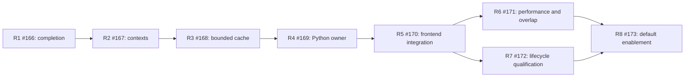

# Transfer resource reuse implementation plan

Status: planned, tracked by [#165](https://github.com/JueonPark/sym/issues/165).
This plan divides the [resource retention design](transfer-resource-reuse.md)
into eight implementation subissues. The subissues contain the working
checklists, file scopes, acceptance checks, and progress records. No runtime
implementation is included in this planning change.

Start from `main`, which includes the CPU transpose kernel merged in
[PR #164](https://github.com/JueonPark/sym/pull/164) as `13d3447`. The resource
work preserves that kernel and its dispatch. The
[estimated diff](transfer-resource-reuse-diff.md) describes the expected total
footprint; this document defines the delivery order.

## Implementation items and dependencies

Every row is a native GitHub subissue of #165. Its prerequisites are also
recorded as GitHub blocking dependencies, not only in this table.

| Item | Deliverable | Blocked by | Estimated added lines, including focused tests |
| --- | --- | --- | ---: |
| [R1 / #166](https://github.com/JueonPark/sym/issues/166) | Backend completion, bounded HostBackend event records, borrowed worker closure | None | 150–250 |
| [R2 / #167](https://github.com/JueonPark/sym/issues/167) | Reusable native contexts, checked schedule/capacity, safe execution and retirement | R1 | 300–450 |
| [R3 / #168](https://github.com/JueonPark/sym/issues/168) | Bounded cache, exclusive leases, admission, growth, eviction, lifecycle and stats | R2 | 450–650 |
| [R4 / #169](https://github.com/JueonPark/sym/issues/169) | Python resource owner, explicit direct-transfer reuse, GIL-safe ownership | R3 | 350–500 |
| [R5 / #170](https://github.com/JueonPark/sym/issues/170) | Shared compiled/eager adapter resources, opt-in integration and ownership | R4 | 200–350 |
| [R6 / #171](https://github.com/JueonPark/sym/issues/171) | Completed frontend benchmarks and a CPU–PCIe overlap timeline | R5 | 250–400 |
| [R7 / #172](https://github.com/JueonPark/sym/issues/172) | Integrated lifecycle, CUDA-stream, failure and concurrency qualification | R5 | 350–550 |
| [R8 / #173](https://github.com/JueonPark/sym/issues/173) | Qualified default enablement and user documentation | R6 and R7 | 50–120, plus documentation |

These are review-sizing estimates, not limits on correctness work. Shared
helpers, build registration, and test placement can move lines between items.
The original full-design estimate remains approximately 2,200–3,530 additions
and 130–270 deletions/refactored lines, excluding prose documentation.

R6 and R7 can proceed independently once R5 provides the integrated opt-in
path. Test design and benchmark scaffolding can start sooner; acceptance
evidence must use the integrated implementation. R8 waits for both branches
to land and their evidence to pass review.

## What each implementation step establishes

**R1 establishes completion primitives before resources live longer.** Add
backend quiescence that can attempt cleanup despite an existing error. Fix
HostBackend event metadata growth and the borrowed GatherPool close race.
These primitives receive focused tests while existing callers remain intact.
The native CopyBackend interface change requires rebuilding its implementations
and C++ consumers together.

**R2 separates resources from requests.** One native context owns staging,
streams, and optional workers across repeated requests. Compute the chunk
schedule once; reuse it in the checked execution core. Preserve forward D2H
source-span staging. Failure guards establish completion before recycling
storage, or retain all resources and tensor owners when completion is unknown.
A deterministic pending-copy test proves that a second staging slot permits
the next CPU gather to proceed.

**R3 adds bounded sharing.** Build the cache around the validated context,
with one exclusive lease per request. Reserve capacity before constructing or
growing resources, wait fairly under temporary contention, and reject
impossible limits. Tests cover accounting, oversize ephemeral contexts,
eviction, clear/close, rollback, quarantine, and changing shapes. If policy and
concurrency changes are too large for one review, use two dependent PRs under
#168 and record each remaining acceptance item there.

**R4 exposes explicit ownership to Python.** Introduce TransferResources and
`execute_transfer(..., resources=...)`. Bind source/output lifetime tokens
before releasing the GIL and make admission and close safe for Python threads.
Direct calls continue to use ephemeral resources when the option is omitted.
Fresh outputs, validation, and blocking completion remain part of every call.

**R5 integrates compiled and eager execution with opt-in reuse.** A
TransportAdapter shares its owner across recipes, shapes, and graph entries.
Explicit `AUTO` requests lazy adapter ownership; explicit objects are borrowed.
Omitting the policy still selects ephemeral execution at this stage. Close
must release only owned resources, and typed/fake paths remain unchanged.

**R6 measures the actual frontend.** Compare explicit reuse with ephemeral
execution under identical chunk, slot, stream, and worker settings. Include
validation and fresh output allocation, and wait for transfer completion
inside each timed sample. Record cold latency, warmed distributions, resource
counters, CPU Inductor and GPU transpose comparisons, and a one-buffer control.
A CPU/GPU timeline must show the next chunk's gather overlapping the preceding
chunk's DMA. A lower latency alone does not establish that property.

**R7 qualifies integrated lifetimes.** Exercise changing caller streams,
retained outputs, device selection, long runs, concurrent admission and
shutdown, and failures after copies have started. Check GIL-safe owner
destruction, unknown-completion retention, and host sanitizer results. This
extends the tests shipped with each preceding step; it does not defer their
unit correctness until the end.

**R8 enables the default after qualification.** Change the omitted frontend
policy to `AUTO` only when R6 and R7 satisfy their gates. Keep explicit `None`
as the opt-out, and keep direct calls ephemeral by default. Confirm resource
limits against measured memory/concurrency behavior, document the implemented
API, and complete the parent acceptance record.

## PR and branch workflow

Use one primary implementation PR per subissue, adding smaller dependent PRs
when an item exceeds a coherent review scope. Each PR links its subissue,
states its base and prerequisite PR, and includes the focused checks for its
own changes. Suggested branch names are recorded in the subissues.

1. Start R1 from current `main`. If a prerequisite has merged, start its child
   from updated `main` as well.
2. If a prerequisite is still in review, branch from that prerequisite's tip
   and open the child PR against that branch. This makes the child diff show
   only its own changes. Record the exact parent tip used, the parent PR,
   and the reviewed child commit in the child description.
3. Keep dependent PRs draft until their prerequisites and own acceptance
   checks are ready. Test each actual branch head; a green parent PR does not
   establish that its child passes.
4. Merge prerequisites first. After a parent lands, rebase/retarget its child
   onto current `main`, inspect the resulting diff, and rerun affected checks.
   With a squash merge, use the recorded old parent tip to replay only child
   commits rather than duplicating the parent's changes. Any required push
   rewriting the feature branch uses `--force-with-lease`.
5. R6 and R7 can both branch from R5 while it is under review. Neither needs
   the other as its base. Integrate prerequisite updates into both branches.
6. Start the R8 enablement PR from `main` after R6 and R7 merge. It consumes
   both evidence records; it must not enable the default on a branch missing
   either qualification gate.

Stacking is a delivery option when a prerequisite is still unmerged, not a
requirement to keep all eight branches open. The design/plan documentation PR
is separate from the code stack; implementation starts from the merged kernel
baseline and incorporates any design revisions from review.

Use `Refs #<subissue>` while an issue spans multiple PRs; only the final PR
should carry a closing reference after all of its acceptance criteria are
satisfied. Verify the issue closes after its changes reach `main`, because
merging a child PR into a feature branch alone does not complete the work.
Intermediate PRs reference #165 without a parent-closing keyword. Only R8 may
close #165, after all eight items and the parent checks are complete.

## Progress and acceptance tracking

Keep each subissue as the working implementation record. As work progresses,
link its PRs, update completed checklist items, and record the tested commit,
commands/configuration, results, and outstanding limitations. A branch or PR
existing is not evidence that the implementation item is complete.

The parent issue's original acceptance checks map to these delivery items:

| Parent acceptance requirement | Implemented by | Integrated evidence |
| --- | --- | --- |
| Compatible frontend calls stop recreating staging, streams, and workers | R2–R5 | R6 counters; R7 long runs |
| Exact current inputs, changing capacities, padding/layout coverage, independent outputs | R2 and R4–R5 | R7 regression matrix |
| Streams, concurrency, devices, exhaustion, safe cleanup, close and eviction | R1–R5 | R7 failure/lifecycle matrix |
| Bounded retained bytes, contexts and workers | R3 | R7 long runs; R6 memory report |
| Completed frontend cold/warm measurements with full configuration | R4–R5 | R6 benchmark results |
| CPU Inductor/GPU comparisons and one-buffer control | R2 and R5 | R6 benchmark and overlap timeline |

R8 records the links proving these checks before closing the parent. Hardware
or profiler gaps must be reported explicitly; they are not passing results.
Unresolved lifetime/correctness defects or missing reference performance and
overlap evidence block default enablement. A measured regression requires an
investigation and documented disposition before that gate can pass.

The scope remains layout-only H2D and forward D2H, with fresh output tensors
and blocking completion. It excludes output pooling, typed caching, CUDA
graph capture, event-object pooling, a new D2H overlap algorithm, automatic
CPU/GPU placement, and a nonblocking frontend. The existing CPU transpose
kernel and CPU–PCIe chunk pipeline remain regression requirements throughout.
