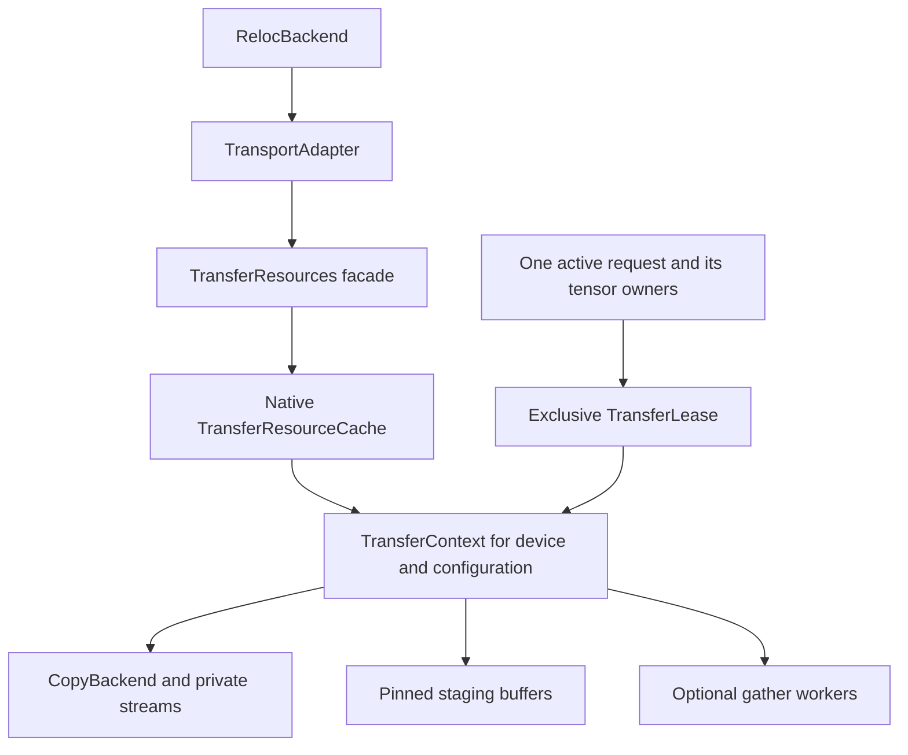
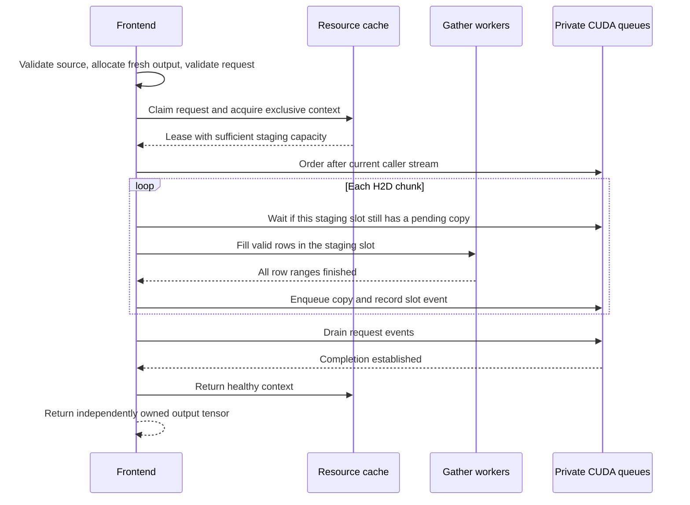

# Retaining transfer resources across frontend calls

Status: implemented for [issue #165](https://github.com/JueonPark/sym/issues/165).
The [enablement record](transfer-resource-enablement.md) maps acceptance checks
to merged work and qualification evidence; the [user guide](torch-integration.md#shared-resources-for-compiled-and-eager-calls)
documents the current API. This document retains the design rationale and
original implementation sequence. Its original baseline was `13d3447`, including
the CPU transpose kernel in [PR #164](https://github.com/JueonPark/sym/pull/164).
That committed tree is identical to the original kernel commit `d019d1b`.
See [the historical implementation estimate](transfer-resource-reuse-diff.md) for
the planned code footprint and schematic changes, and the
[implementation plan](transfer-resource-implementation-plan.md) for tracked
subissues, dependencies, and the PR workflow.

Sym retains the pinned host buffers, CUDA streams, and CPU workers used
by repeated layout transfers in an explicitly owned, bounded resource cache.
One request exclusively leases each context until its work completes. The
compiled and eager frontends share this cache through their runtime adapter;
direct callers can supply the same resource owner explicitly.

The first implementation preserves blocking transfers, fresh output tensors,
per-request validation, and the existing chunk schedule. It covers layout-only
H2D and forward D2H. Typed dispatch, output storage reuse, CUDA graph capture,
event-object pooling, and a nonblocking frontend remain separate work.

## Why resource lifetime matters

A layout transfer produces a dense output with its elements physically
reordered. For H2D, CPU gather workers write one output chunk directly into
pinned host memory. CUDA copies that chunk to the GPU while the CPU can
prepare another. Pinned memory is host memory allocated for GPU transfers;
a stream is an ordered queue of GPU operations. A gather pool owns the CPU
threads preparing the chunks.

The original frontend created these resources for each request, executed the
pipeline, waited, and destroyed them. The implemented cache keeps the resources
after completion and overwrites staging with the next request's data.
Compiled plans, request objects, tensor values, and reusable execution
resources have different lifetimes.

Original prototype evidence recorded in #165 on EPYC 7351 / RTX 2080 Ti / PCIe
Gen3 x16 (superseded for enablement by the [completed frontend measurements](../bench/results/transfer-resource-reuse-171/README.md)):

| Completed 4096 x 1024 FP32 transfer | Median latency |
| --- | ---: |
| Original Sym frontend | 27.919 ms |
| Sym native pipeline with resources and output preallocated | 3.503 ms |
| CPU Inductor plus H2D with staging and output preallocated | 4.693 ms |
| H2D plus Torch GPU transpose with buffers preallocated | 1.740 ms |

These used an eight-thread budget on four physical cores with SMT, Torch
2.14.0+cu126, pageable CPU inputs, and completion inside the timed interval.
Separate warmed creation/destruction measurements were 22.688 ms for four
4 MiB pinned buffers, 0.016 ms for two streams, and 0.337 ms for an eight-thread
gather pool. #165 contains the sampling methodology and limitations.

The native comparison also removes frontend validation and output allocation.
It motivates this design but does not predict the final frontend latency.
Resource reuse must be evaluated through the actual frontend, including its
fresh outputs and completed transfers. GPU placement remains a relevant
comparison.

## Implementation sites

| Owner or operation | Implemented change |
| --- | --- |
| [`PyTransfer.cpp`](../libreloc/python/PyTransfer.cpp) | Optional cached execution retains backend ownership in a context. |
| [`Transfer.cpp`](../libreloc/src/Transfer.cpp) | H2D execution uses staging and workers from an exclusive lease. |
| Forward D2H in `Transfer.cpp` | A separate single-buffer context covers `sourceSpanBytes`. |
| [`Pipeline.cpp`](../libreloc/src/Pipeline.cpp) | The checked entry point accepts the already-computed schedule and caller-owned resources. |
| [`TransportAdapter`](../libreloc/python/reloc_torch/runtime.py) | One owner serves compiled/eager calls across recipes and shapes. |
| [`RelocBackend.close`](../libreloc/python/reloc_torch/backend.py) | Stops new entry execution, then closes its owned adapter. |
| [`CudaBackend`](../libreloc/cuda/CudaBackend.cu) | Failed contexts retire instead of returning to reuse. |
| [`HostBackend`](../libreloc/src/HostBackend.cpp) | Completed event records retire, bounding persistent metadata. |

Two failure boundaries require particular care. A zero event handle means
"no event", but CUDA event creation/recording can fail after a copy was queued.
Waiting on zero cannot prove completion. Cleanup establishes backend quiescence
before freeing staging. If completion cannot be established, the cache retains
resources and tensor ownership in charged quarantine rather than reusing or
freeing them. This applies to exceptional exits as well as normal retirement.

## Ownership and public interface

Use three native types, all in the Torch-free runtime:

- `TransferResourceCache`: owns contexts, limits, accounting, admission, and
  idle eviction. Its constructor performs no CUDA initialization or allocation.
- `TransferContext`: owns a `CopyBackend`, staging allocation(s), and optional
  `GatherPool`. It holds no compiled plan, tensor pointer, or caller stream
  between successful requests. This is a Sym resource owner, not a CUDA context.
- `TransferLease`: a move-only, exclusive reservation of one context plus the
  current request's lifetime token. Successful completion returns the context
  to the cache; failure retires or quarantines it.



The Python `TransferResources` facade lives in `reloc_torch/resources.py`,
backed by `pyreloc.TransferResourceCache`. The facade handles Python ownership
and context-manager lifecycle. Neither native objects nor package imports
introduce a Torch dependency into `reloc_runtime`.

The native boundary is:

```cpp
TransferOutcome executeTransferCached(
    TransferRequest &request, TransferResourceCache &resources,
    const CachedTransferOptions &options,
    std::shared_ptr<void> bufferOwners);
```

`CachedTransferOptions` contains the existing buffer/chunk/thread settings,
the private stream count, this request's caller-stream dependency, and an
optional shared owner for an external gather pool. `bufferOwners` is required
and owns both buffer allocations through any exceptional completion path.
`TransferOutcome` carries an optional `TransferError` and completion state
(`not_launched`, `complete`, or `unknown`). The binding raises on errors after
native cleanup or quarantine has taken ownership. A backend factory injected
at cache construction supplies instrumented HostBackends for native tests.

Direct-call usage:

```python
from reloc_torch import TransferResources
from reloc_torch.transport import prepare_transfer, execute_transfer

with TransferResources(max_retained_bytes=256 << 20) as resources:
    for source in inputs:
        request = prepare_transfer(compiled_recipe, source, "cuda:0")
        output = execute_transfer(
            request, resources=resources, gather_threads=8,
        )
        consume(output)
```

`execute_transfer` accepts an optional `resources` keyword. Omission retains
ephemeral behavior for direct callers. All existing buffer,
stream, worker, and external-pool keywords keep their meanings.

Omitted `RelocBackend.transfer_resources` selects `AUTO` for its owned adapter;
`transfer_options` defaults to `None`.
`AUTO` lazily creates an adapter-owned cache, so ordinary repeated compiled
and eager layout transfers benefit without changing each invocation. `None`
explicitly selects the old resource policy for comparison. Passing a
`TransferResources` borrows it. `transfer_options` is a validated, copied
mapping of the existing execution knobs; defaults remain four buffers, two
streams, and one gather participant.

When a caller supplies a custom `runtime`, omitted or explicit `None` resource
policy leaves it unchanged; explicit `AUTO`, a resource owner, or non-None
transfer options are rejected as ambiguous. The custom runtime owns its policy.
A `RelocBackend`-created adapter owns its lazy AUTO cache; a standalone
`TransportAdapter()` still defaults to ephemeral resources. An injected adapter
or cache remains caller-owned. Ownership is explicit rather than inferred from
reference counts.

Closing an individual execution entry releases no shared transfer resources.
Closing the backend stops new entry execution, then closes its owned adapter
outside the backend's Python lock. A borrowed cache can serve another backend
after the first closes. Graph execution that races with close either already
owns a lease and completes, or fails admission with `resources_closed`.

Keep custom-op schemas and metadata-only fake implementations unchanged.
Preflight binds and validates but never allocates cached resources. The typed
branch of `TransportAdapter` continues through its existing dispatch API and
must not claim resource-cache hits in this release.

## Compatibility and capacity

Context compatibility is a resource property. It does not depend on tensor
addresses, exact shape, dtype, recipe ID, or caller-stream address.

| Key field | Rule |
| --- | --- |
| Backend kind and device | Host and CUDA are separate; resolve a CUDA ordinal before admission. |
| Direction/storage mode | H2D ring and forward-D2H single staging allocation are separate. |
| Private stream count | Exact configured count. |
| H2D active staging slots | Exact effective slot count; D2H uses one. |
| Worker mode | Inline, owned with resolved participant count, or externally supplied. |
| Placement identity | On Linux, include the calling thread's CPU-affinity mask; include any explicit future NUMA policy. |

Record the creating PID and process epoch on the cache. Reject use after fork
before taking inherited locks. Do not pickle resource objects or put them in
compiler artifacts. Construct new owners in spawned worker processes. A
device reset requires closing caches first; reusing resources across an
external reset is unsupported.

Affinity compatibility prevents silently reusing workers created under a
different mask. It does not claim optimal GPU-local NUMA placement. Workers
inherit the creating caller's affinity; automatic affinity changes and memory
migration are outside this proposal. Resolve `gather_threads=0` using the
existing policy, without silently reducing an explicit thread budget.

For H2D, compute `planChunks(bound, configured_n_buffers, chunk_override)`
once for each request. Set:

```text
active_slots = min(configured_n_buffers, schedule.chunks.size())
required_slot_bytes = schedule.maxChunkBytes
```

Valid transfers have at least one chunk. A single-chunk request needs one
slot even if the configured maximum is four. Add a checked pipeline entry
point receiving this schedule and the active slot count. Do not recompute
the schedule using a cached capacity or the reduced slot count: the current
heuristic depends on `nBuffers`, so doing so could change chunk boundaries.

For forward D2H, required capacity is validated `request.sourceSpanBytes`,
not destination bytes. Download the source, wait, and run the existing forward
gather. This design does not substitute inverse scatter or introduce D2H
chunk overlap.

Round allocation capacity up to 256 KiB with checked arithmetic. This is a
policy granularity, not a measured optimum. It never changes copy
lengths, padding, or the chunk schedule. Every execution performs a release-build
check that its allocation covers the required bytes. Row sizes can exceed
the chunk target, and serialized schedules can require whole-tensor staging;
neither may be assumed to fit the nominal 64 MiB chunk ceiling.

With the current 4 MiB minimum chunk target and four configured buffers, a
1 MiB transfer needs one 1 MiB slot; a 16 MiB transfer needs four 4 MiB slots.
A D2H source span of 400 MiB needs one 400 MiB allocation and uses the oversize
policy below. These examples describe required storage, not latency targets.

Among compatible idle contexts choose the smallest sufficient capacity. If
only a smaller one is available, lease it exclusively and grow its staging
while preserving healthy streams and workers. Free the completed old staging
before allocating the replacement, so growth does not temporarily require
both allocations. A failed growth retires the context and fails the request.

## Limits and admission

The following defaults were retained after the R6/R7 review; see the
[budget decision](transfer-resource-enablement.md#budget-decision):

| Limit | Default | Meaning |
| --- | ---: | --- |
| `max_retained_bytes` | 256 MiB | Sum of reserved and allocated cacheable staging, including leased contexts. |
| `max_contexts` | 4 | All contexts owned by this cache, including construction, retirement, and quarantine. |
| `max_contexts_per_device` | 2 | Same count restricted to one backend kind/device. |
| `max_background_workers` | 64 | Owned gather threads across all context states; caller threads are excluded. |
| `max_live_staging_bytes` | `None` | Optional hard limit including transient staging, reservations, and quarantine. |
| `acquire_timeout_ms` | `None` | Wait for contention by default; an explicit timeout fails before any copy. |

Limits belong to one explicitly owned cache. Multiple independent caches
multiply process resource use. Applications needing a shared limit should
pass one owner to their backends. External gather pools and tensor allocator
memory are outside this cache's budget and are reported separately.

A request whose rounded staging requirement exceeds `max_retained_bytes`
runs with an ephemeral context, subject to context, worker, and optional live
byte limits. Destroy that context after completion. This preserves large
transfers, especially forward D2H, without retaining arbitrarily large buffers.
It is a resource policy chosen before launch, not a replay through Torch.

The retained-byte limit is not a hard limit on total pinned memory. The
optional live-byte limit supplies that stronger contract. An intrinsically
oversized live-byte or worker request fails with `resource_limit`; it must not
wait for capacity that can never exist or silently change thread settings.

Admission metadata is protected by one native mutex:

1. Check the creating PID before taking the mutex. Reject a closed or
   disabled-device cache and impossible limits. Eligible callers enter a FIFO
   admission queue.
2. Reserve a compatible idle context or select idle LRU victims as needed.
   Otherwise reserve a new context slot, bytes, and workers before construction.
3. If active leases temporarily prevent admission, wait on a condition
   variable with the GIL released. Do not allocate an unaccounted context to
   bypass contention. Remove timed-out or closed waiters cleanly.
4. Perform allocation, growth, eviction, and worker construction outside the
   mutex. Keep reservations charged until construction succeeds or cleanup
   actually finishes. Partial construction is exception-safe.
5. Re-enter the mutex to publish the lease or rollback. A concurrent close or
   clear generation change prevents publishing a newly idle stale context.

FIFO admission may cause head-of-line waiting; that is an explicit initial
tradeoff for deterministic bounded admission. A request holds at most one
lease. Recursive acquisition from a gather callback is unsupported and must
fail rather than deadlock. Cache locks never span CUDA waits, worker barriers,
Python callbacks, allocations, or destructors.

For growth from P bytes to Q bytes, reserve the positive delta Q-P during
admission while P remains charged. After freeing the old allocation, convert
its charge into a reservation, then allocate Q bytes. This preserves the
entire target reservation across the unlocked allocation phase without
double-counting physical memory or letting another admission steal capacity.
For eviction, keep a retiring context charged until its resources are released.
No other caller may consume bytes that are merely scheduled to be freed.

## Per-request execution and completion



Keep the existing source snapshot recheck and native source/destination span
validation. The source and output remain strongly owned across admission
waiting, execution, and cleanup. As with the existing blocking API, callers
must not resize or mutate participating storage concurrently.

Caller stream identity is captured for the current invocation, never cached.
Establish its dependency on every lease. Retained private streams do not
inherit the dependency of a new request automatically. Successfully draining
the pipeline makes the output immediately usable under the current blocking
contract without an added `cudaDeviceSynchronize`.

Preserve the request-consumption boundary: argument/preflight/device rejection
before native execution leaves a native request unconsumed; after native
execution claims it, admission, allocation, and execution failures consume it.
The Python prepared request remains single-use once handed to execution.
Raw C++ callers must serialize access to a request object. Execution errors
never become `UnsupportedRecipe` or trigger the original region again.

Retaining resources does not memoize input values, retain successful output
tensors, pin source tensor allocations in place, or allow a later call to
overwrite an earlier output. The retained context contains only reusable
machinery after a successful return.

## Failures and safe retirement

The lease has explicit states: `building`, `leased`, `idle`, `retiring`, and
`quarantined`. Return to `idle` requires a healthy backend, completed gather
jobs, and proof that no copy accesses request storage. Zero pending handles
alone is insufficient proof after an error.

Add `CopyBackend::quiesce()` with a result distinguishing established completion
from unknown completion. It must attempt every owned queue even when the
backend already has a sticky error. CUDA uses synchronization of its private
streams; HostBackend waits for queued and executing tasks, without allocating
another event. Preserve the original failure separately from cleanup errors.
External CopyBackend implementations must implement this new contract and
rebuild against the changed C++ interface.

On the healthy path, successfully waited events remain the completion proof;
no extra stream synchronization is added. On any failed gather/copy/event
phase or exception, stop submitting work, finish outstanding CPU jobs, and
quiesce the owned queues before releasing storage. Check backend failure
between chunk phases so `acquire()` cannot hand failed-event staging back to
CPU writers.

| Failure | Required action |
| --- | --- |
| Resource limit, timeout, or close during admission | Release reservations; report the execution error; launch nothing. |
| Partial stream, worker, or staging construction | Clean up completed construction; never publish a partial context. |
| Copy queued, then event creation or recording fails | Stop submission and quiesce queues; never interpret event zero as completed work. |
| Backend failure with completion established | Retire the context, release owners, and report the original error. |
| Completion remains unknown | Quarantine resources and tensor owners, disable further admission for that device in this cache, and report `completion_unknown`. |

Quarantine must retain source and destination owners as well as staging: an
H2D copy may still write the output, and a D2H copy may still read the input.
The cached native entry point therefore receives a type-erased shared lifetime
token supplied by its caller. The Python binding constructs that token from
strong source/output references before releasing the GIL, with GIL-aware
normal destruction. Raw cached C++ callers supply an equivalent owner token.
The runtime never inspects Torch objects.

An unrecoverable quarantine moves the complete lease and token to a
process-lifetime holder; it must not depend on an exception object staying
alive. Keep its allocation counts charged and expose them in diagnostics.
Closing the cache reports incomplete cleanup and cannot claim zero live bytes.
There is no automatic device reset or unsafe free. This exceptional path may
retain memory until process exit; normal successful calls retain no tensor
owners. The implementation must qualify the binding's shutdown behavior and
failure injection before automatic caching is enabled.

CUDA stream destruction does not itself establish host-side completion: it
can return while previously submitted work remains in progress. Use the
documented completion operation and preserve owners if it cannot establish
completion. See the [CUDA stream API](https://docs.nvidia.com/cuda/archive/12.6.3/cuda-runtime-api/group__CUDART__STREAM.html).

## Event bookkeeping and lifecycle operations

Keep CUDA event creation/recording/waiting behavior initially. Event-object
pooling can be measured later. Fix HostBackend's event bookkeeping now:
waiting successfully on an event retires its record, and subsequent waits or
queries on that retired handle report completion, matching CUDA's existing
consumed-handle behavior. Event storage must be proportional to outstanding
work, not the number of calls since context creation.

`clear()` does not wait for active requests: increment the cache generation,
evict idle contexts, and mark older active/building contexts for retirement on
return. Idle destruction can itself take time; this is not a guarantee of
immediate return. Admit new requests subject to the same limits. Counters stay
charged while old resources are retiring. This operation resets retained
resources, not accumulated stats.

`close()` is idempotent and blocking for ordinary active work. Stop admission,
wake waiters with `resources_closed`, wait for building/leased/retiring contexts,
and release them in dependency order. Use no Python lock while waiting and
release the GIL in native close. Keep the backend alive while freeing its
staging; finish and close owned workers before destroying the backend.
Borrowed gather pools are never closed by the cache.

A supplied external gather pool wins over `gather_threads`, as today. Hold it
strongly for that lease and reject an already-closed pool before execution.
Preserve the existing dispatch/close serialization, but make the race before
`parallelFor` entry safe in debug builds too: a pool closed after admission
runs subsequent row ranges inline, rather than hitting the current entry
assertion. A running parallel range finishes before close joins its workers.
Such contexts own no gather pool and do not retain the external pool between
calls. Sharing an external pool can serialize CPU gathers across contexts;
document that performance effect.

Use deterministic close/context managers in examples and tests. Finalizers
are a best-effort fallback, not the normal CUDA shutdown protocol. Creating
the cache and inspecting stats must remain safe without CUDA initialization.

## Observability

Expose a scalar snapshot through `TransferResources.stats()` and a namespaced
`transfer_resources` member of `RelocBackend.stats()`. Include per-device
breakdowns where meaningful:

- Requests, compatible hits, capacity growths, new contexts, evictions,
  oversized ephemeral executions, admission waits/timeouts, failures, and
  quarantines.
- Staging allocations/frees, stream creations/destructions, owned worker
  creations/joins, event creations/retirements, and outstanding event count.
- Context counts by state; cacheable reserved/allocated bytes; all live staging
  bytes; peak live bytes; owned background workers; quarantine bytes.

A hit means a compatible context had sufficient capacity with no resource
creation or growth. It does not mean a recipe-cache hit or an allocation-free
frontend call: fresh tensor output allocation remains expected. Hot-path
timing breakdowns are optional profiling instrumentation so ordinary requests
do not pay for phase timestamps.

## Implementation sequence

The [implementation plan](transfer-resource-implementation-plan.md) is the
delivery sequence. Each step has its own focused tests and tracked acceptance
checks; integrated qualification does not replace those tests.

| Step | Tracked deliverable | Prerequisite |
| --- | --- | --- |
| [R1 / #166](https://github.com/JueonPark/sym/issues/166) | Backend completion, bounded event records, worker-close safety | Merged kernel baseline |
| [R2 / #167](https://github.com/JueonPark/sym/issues/167) | Reusable native contexts, checked execution and safe retirement | R1 |
| [R3 / #168](https://github.com/JueonPark/sym/issues/168) | Bounded cache, exclusive leases, lifecycle and accounting | R2 |
| [R4 / #169](https://github.com/JueonPark/sym/issues/169) | Explicit Python resource owner and direct-call reuse | R3 |
| [R5 / #170](https://github.com/JueonPark/sym/issues/170) | Opt-in compiled/eager integration and ownership | R4 |
| [R6 / #171](https://github.com/JueonPark/sym/issues/171) | Completed frontend measurements and overlap trace | R5 |
| [R7 / #172](https://github.com/JueonPark/sym/issues/172) | Integrated concurrency, failure and lifecycle qualification | R5 |
| [R8 / #173](https://github.com/JueonPark/sym/issues/173) | Default `AUTO` enablement and user documentation | R6 and R7 |

Keep the legacy native `executeTransfer(request, backend, options)` entry
point for caller compatibility. Share one checked execution core with the new
cached entry point instead of duplicating gather or direction semantics.
Extend CMake sources, tests, installed headers, and the runtime dependency
guard alongside the new native types. The benchmark must be committed and
configurable; temporary prototype scripts are not the acceptance harness.

## Validation and performance gate

Native tests use an instrumented HostBackend with controllable copy completion
and injected allocation/copy/event failures. Counters and synchronization
barriers establish behavior; wall-clock sleeps do not establish correctness.

| Scenario | Required observation |
| --- | --- |
| Repeated same-capacity calls with changing input bits | Exact fresh outputs; allocation/stream/worker counters stop increasing after warmup |
| Alternating shapes within capacity, then growth | Reuse within capacity; checked growth; retained old outputs stay unchanged |
| Fewer chunks than configured buffers | Only required slots allocated; chunk boundaries match the original schedule |
| Large row, serialized H2D, and source-span-heavy D2H | Correct capacity, no truncation, defined oversize handling |
| Padding and supported non-transpose layouts | Whole copied windows initialized by the existing fill/gather semantics; no stale staging bytes |
| Concurrent callers, exhausted context slots, timeout | Exclusive leases, bounded allocations, eventual admission or explicit timeout |
| Partial construction and failed event after queued copy | No partial publication, no premature overwrite/free, no fallback replay |
| Cleanup cannot establish completion | Owners remain strongly retained, context quarantined, device admission disabled, counts visible |
| Long run through HostBackend | Outstanding event map returns to zero after completed requests |
| Clear/close racing with allocation, waiting, and execution | No deadlock or stale idle publication; ordinary close releases all owned resources |
| Borrowed cache/pool and multiple backend owners | Closing a borrower does not close shared resources; external-pool close during a lease safely completes or runs remaining work inline |
| Foreign PID and serialization attempt | Rejected before inherited locks or CUDA resource use |

CUDA qualification covers default and alternating nondefault caller streams,
immediate consumers, H2D and forward D2H, two devices when available, retained
outputs under allocator pressure, and CPU/GPU overlap with bounded slots.
Keep unsupported capture/nonblocking behavior unchanged. Run native sanitizers
and resource tests in release builds as well as debug; capacity safety cannot
depend on assertions.

The committed benchmark compares the same frontend with `resources=None`
and with a retained owner. Both paths perform per-call binding, validation,
fresh output allocation, and completion. Record first-call latency separately
from warmed p50/p95 and all raw samples. Include source shapes 4096 x 1024,
1024 x 4096, 256 x 1024, and 1009 x 4093; single- and multithread budgets;
changing shapes; concurrent callers; and forward D2H. Compare CPU Inductor
plus transfer and transfer plus GPU transpose under explicitly stated
allocation policies.

Use the same requirements calculation and effective slot count for both
resource policies in this comparison. Otherwise reducing four unnecessary
allocations to one on a small transfer would confound retention with a buffer
count change. Report comparisons against the historical implementation as a
separate result.

Fix chunk size, stream count, and thread budget for the one-buffer/multiple-
buffer control; otherwise schedule changes can masquerade as overlap gains.
Record hardware, runtime versions, affinity, buffer placement, source revision,
limits, resource counters, and peak memory. Measure latency and concurrent
throughput separately. Compilation stays outside timing.

Release requires zero additional pinned allocations, stream creations, and
owned-worker creations for repeated compatible successful calls after warmup,
bounded event/retained-memory counts, all lifecycle tests, and a measured
steady-state frontend improvement on the reference workload without an
unexplained regression in the qualification matrix. The 3.503 ms native result
and a win over GPU transpose are not acceptance targets.

## Alternatives considered

Reusing only `GatherPool` is already possible and leaves the largest measured
setup cost in place. Attaching buffers to each compiled recipe would multiply
memory with graph/cache entries and would not share capacity across recipes.
An implicit global or thread-local cache complicates explicit close, aggregate
accounting, affinity changes, and worker-process ownership. An explicit owner
shared by adapters provides a clear lifecycle and configurable scope.

Changing to Torch's pinned allocator could also reduce allocation cost, but
would require a separate allocator-ownership bridge while leaving stream and
worker lifetime decisions. Returning before completion would require a new
frontend contract. This proposal first reuses the runtime objects and blocking
semantics Sym already has.
